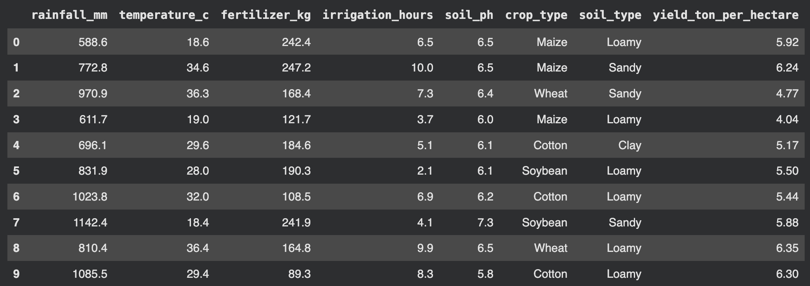
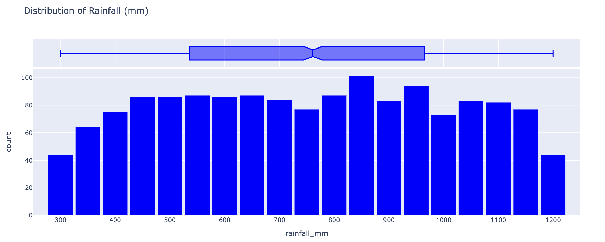
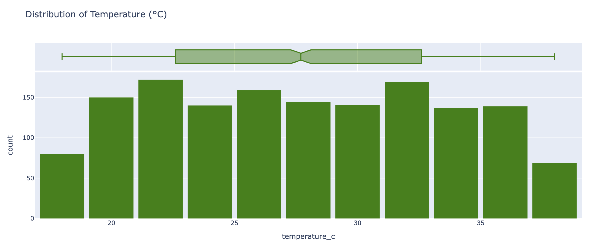
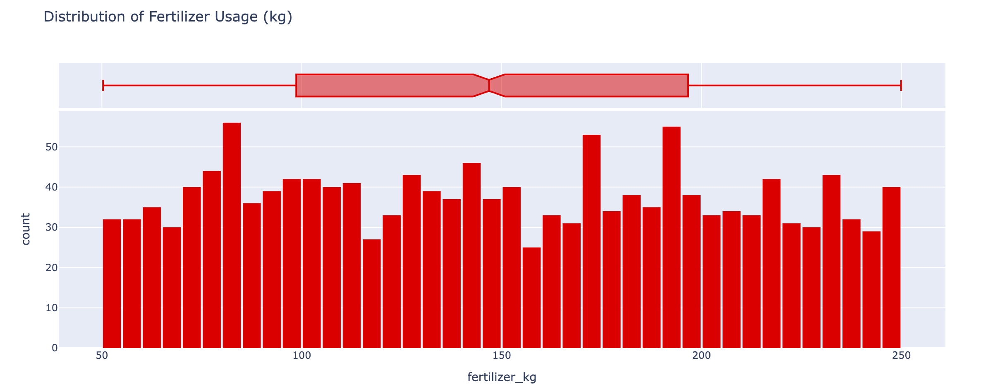
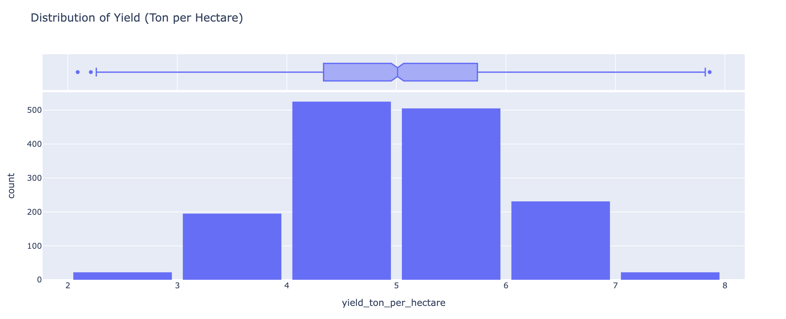
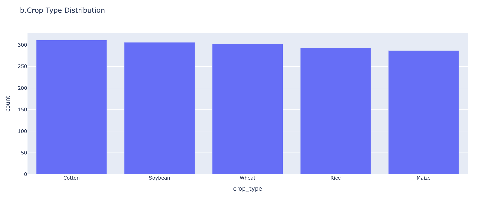
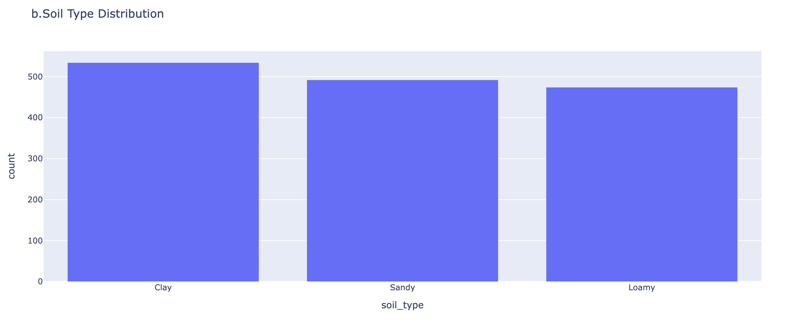
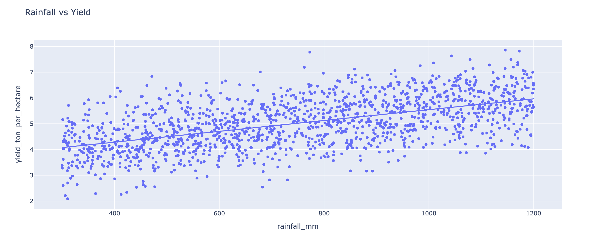
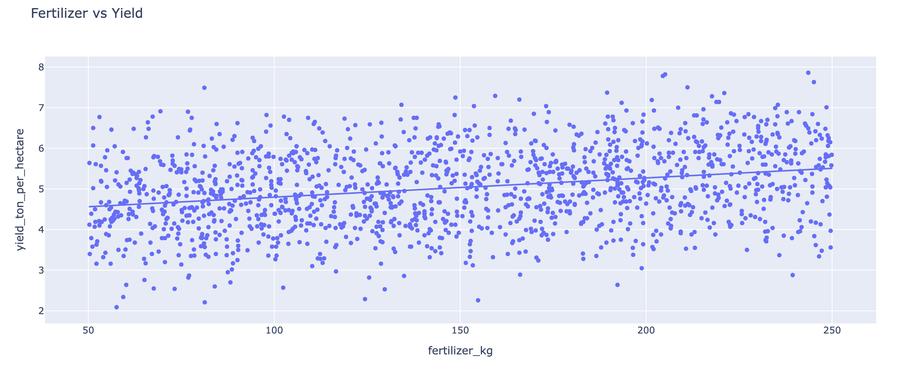
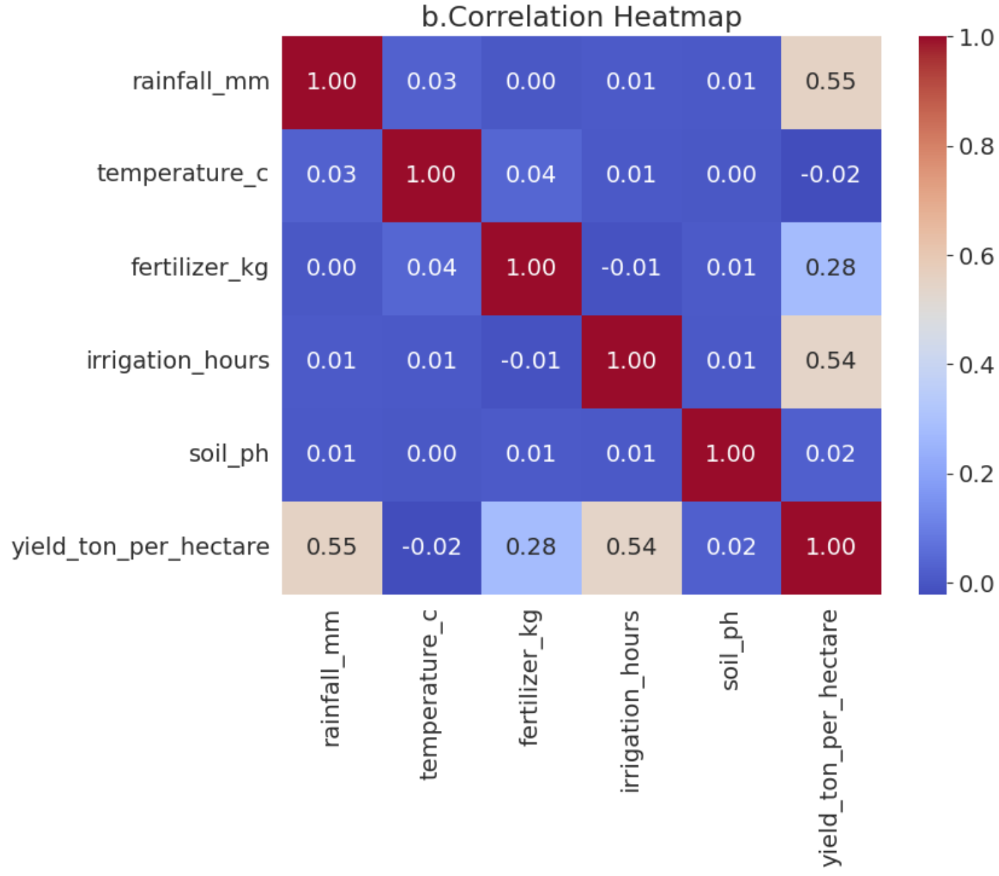

# Exploratory Data Analysis (EDA) and Machine Learning on Agricultural Yield Dataset

## 1. Project Overview

### Objective

The objective of this project is to perform Exploratory Data Analysis (EDA) and build a Linear Regression model to predict agricultural crop yield using environmental and farming-related factors.

### Tools and Libraries Used

* Python
* Pandas
* NumPy
* Plotly / Matplotlib / Seaborn
* Scikit-learn

---

# Part A: Understanding the Dataset

## Q1. Dataset Overview

### Number of Rows and Columns

* Rows: 1500
* Columns: 8

### Column Names

* rainfall_mm
* temperature_c
* fertilizer_kg
* irrigation_hours
* soil_ph
* crop_type
* soil_type
* yield_ton_per_hectare

### First 10 Records

---

## Q2. Data Types and Missing Values

### Data Types of the columns

### Missing Values Analysis
Zero missing values

## Q3. Descriptive Statistics

### Summary Statistics

### Highest Mean Value

* Feature: rainfall_mm
* Mean: 754.055

### Highest Standard Deviation

* Feature: rainfall_mm
* Standard Deviation: 255.097

# Part B: Exploratory Data Analysis (EDA)

## Q4. Distribution Analysis

### Rainfall Distribution

#### Observations

1. The histogram has a fairly uniform distribution rather than a normal distribution
2. From the box plot, the histogram has no noticeble outlier
3. There is no single range dominating the plot

---

### Temperature Distribution

#### Observations

1. From the box plot, the histogram has no noticeble outlier
2. While there are no drastic irregularities, temperature at lower and higher ends are less prevelant
3. There is no single range dominating the plot

---

### Fertilizer Distribution

#### Observations

1. The plot doesn't show a normal distribution but rather irregular distribution
2. There is no noticeble outliers
3. There is no single range dominating the plot. Mulitple peaks are distributed across the plot

---

### Yield Distribution

#### Observations

1. The plot shows a normal distribution which is fairly symmetric 
2. There are 3 outliers present: 2 on the lower end and 1 on the upper end
3. The peak of the curve is aroun 5 ton per hectare yield.

---

## Q5. Crop Type Analysis

### Count Plot

### Most Frequent Crop

* Cotton

---

## Q6. Soil Type Analysis

### Count Plot

### Most Common Soil Type

* Loamy

---

## Q7. Yield Distribution Analysis

### Histogram

### Questions

**Is the distribution approximately normal?**

* Yes,the histogram is roughly bell-shaped, with the highest frequencies centered around 5 tons per hectare.
* The data appears fairly symmetric around the center.
* There is no strong skew to the left or right (although the distribution is not perfectly normal).

**Are there any noticeable outliers?**

* Yes, there are total 3 noticeable outliers(points lying outside the whiskers)
* The box plot shows two low-end outliers at 2.09 and 2.21 tons/hectare.
* There is also one high-end outlier at 7.86 tons/hectare.

---

## Q8. Scatter Plot Analysis

### Rainfall vs Yield

---

### Fertilizer vs Yield

### Which feature has a stronger relationship with yield?

* Rainfall(in mm) has a stronger relationship than Fertilizer used(per kg)
* We can tell this by looking at the slop or directly comparing the R2 values.
* R2 values of rainfall vs yield: 0.306
* R2 values of fertilizer vs yield: 0.077

---

## Q9. Correlation Analysis

### Correlation Heatmap

### Top Three Features Most Correlated with Yield

In Descending order
* Rainfall in mm
* Irrigation in hours
* Fertilizer in kg

## Q10. Group-Based Analysis

### Highest Yielding Crop Type
* Rice with 5.49 ton/hectare

### Highest Yielding Soil Type
* Loamy with 5.37 ton/hectare

---

# Part C: Data Preparation

## Q11. Feature Encoding

### Categorical Columns Identified

* Crop Type
* Soil type

## Q12. Feature Selection

### Target Variable (y)

* yield_ton_per_hectare

### Input Features (X)

All remaining encoded features excluding the target variable.

---

# Part D: Machine Learning

## Q13. Train-Test Split

### Split Ratio

* Training Data: 80%
* Testing Data: 20%
---

## Q14. Linear Regression Model

### Model Training

Linear Regression model was trained using the training dataset.

### Intercept

* 1.97

### Feature with Highest Positive Coefficient

* Feature: Irrigation Hours
* Coefficient: 0.2017
As Irrigation hours the highest positive coefficient, it has the strongest positive impact on the predicted crop yield in the Linear Regression model.

---

# Conclusion

The impact of environmental and agricultural factors on crop yield. A Linear Regression model was successfully trained to predict yield based on the available features.

Assignment by 
Vaaruni Gupta
07401222025
Week 3 Assignment 1
